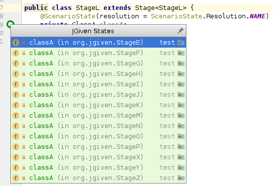
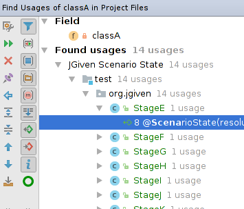
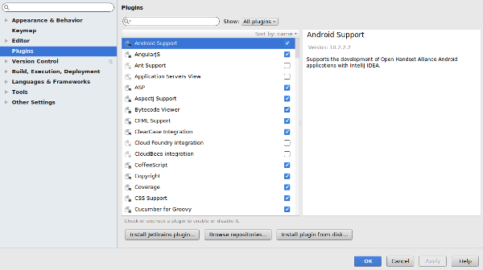

JGiven Plugin for IntelliJ IDEA
===============================

[IntelliJ IDEA](https://www.jetbrains.com/idea/) plugin to support both navigating between scenario states and
 finding usages of scenario states within [JGiven](http://jgiven.org/) test stages.

Features
--------

* All scenario states with usages are annotated 

* When looking for usages of a scenario state field, IntelliJ will also show all other fields referencing this scenario state.
 To make those lists more readable, an additional usage type for JGiven scenario states is available.
 Within this list, all non scenario state usages can be filtered out by clicking the JGiven icon. 

Building
--------

Checkout all source files and run ``./gradlew buildPlugin`` from within the checkout directory.

The installable artifact can be found at ``build/distributions/jgiven-intellij-plugin.zip``.

If you only need access to an installable artifact, you can download the latest build [here](https://jenkins.int.tngtech.com/job/jgiven-intellij-plugin/lastSuccessfulBuild/artifact/build/distributions/jgiven-intellij-plugin.zip).

Installation
------------

The plugin is not yet available within the JetBrains plugin repository. Thus, after obtaining the jgiven-intellij-plugin.zip,
you'll have to install the plugin manually by following the steps below.

 * Open up the ``Settings`` dialog (``File > Settings`` or hit ``Ctrl+Alt+S``).
 * Select ``Plugins`` from the tree
 * Hit ``Install plugin from disk`` and select the zip file you just created (see ``Building``).
 * Restart IntelliJ
 

License
-------

Licensed under the Apache License, Version 2.0.